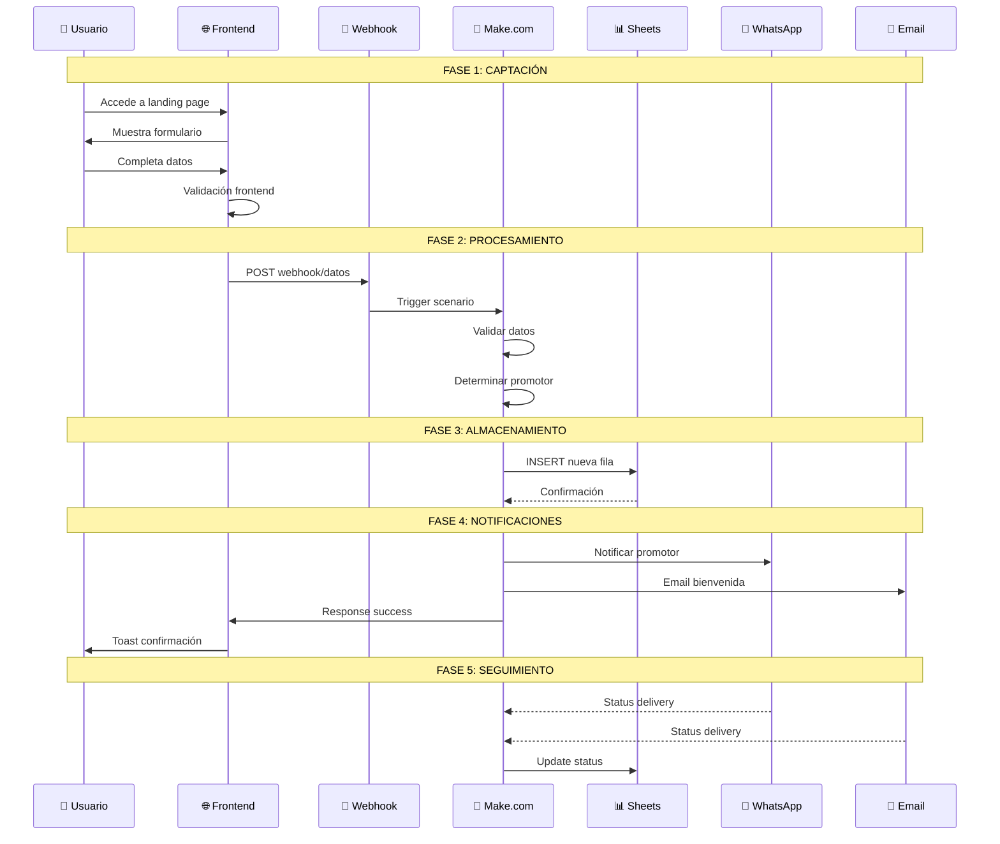
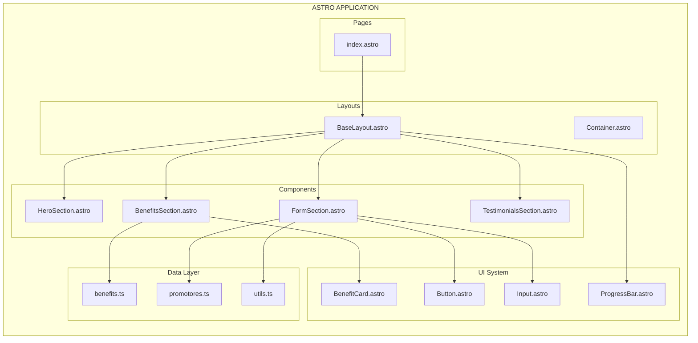
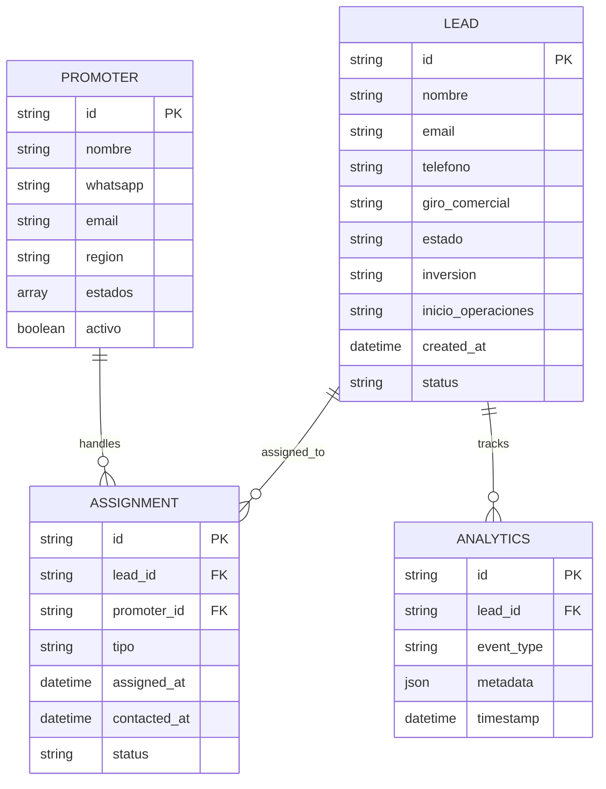
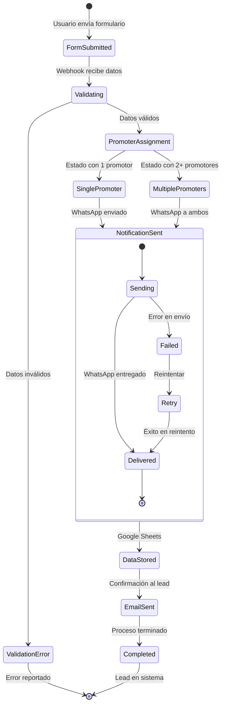
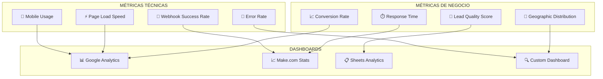
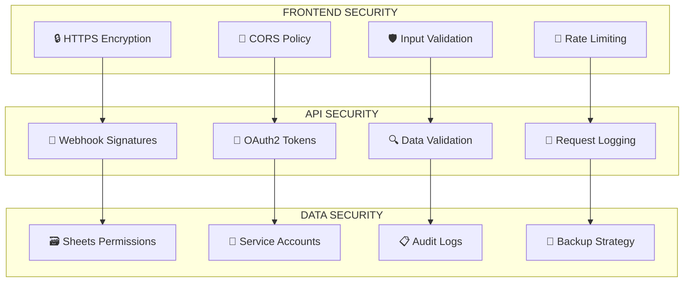

# 🏗️ DIAGRAMA DE ARQUITECTURA - SISTEMA KENDA

## 📊 **FLUJO COMPLETO DEL SISTEMA**

```mermaid
graph TB
    %% FRONTEND LAYER
    subgraph "FRONTEND - Astro Application"
        A[👤 Usuario Distribuidor] --> B[🌐 Landing Page<br/>distribuidorkenda.com]
        B --> C[📝 Formulario de Registro<br/>FormSection.astro]
        C --> D[✅ Validación Frontend<br/>JavaScript + TypeScript]
        D --> E[💾 Auto-save<br/>localStorage]
    end

    %% INTEGRATION LAYER  
    subgraph "INTEGRATION - Make.com"
        F[🔗 Webhook Endpoint<br/>hook.make.com]
        G[🔍 Data Validation]
        H[🎯 Promoter Assignment Logic]
        I[📊 Analytics & Logging]
    end

    %% BACKEND SERVICES
    subgraph "BACKEND SERVICES"
        J[📈 Google Sheets<br/>Database]
        K[📱 WhatsApp API<br/>Notifications]
        L[📧 Email Service<br/>Confirmations]
        M[📊 Google Analytics<br/>Tracking]
    end

    %% BUSINESS LOGIC
    subgraph "BUSINESS LOGIC"
        N[🗺️ Estado Mapping]
        O[👥 Promoter Pool]
        P[⚖️ Load Balancing]
        Q[📞 Contact Assignment]
    end

    %% CONNECTIONS
    D --> F
    E --> F
    F --> G
    G --> H
    H --> I
    
    G --> J
    H --> K
    H --> L
    I --> M
    
    H --> N
    N --> O
    O --> P
    P --> Q
    Q --> K

    %% FEEDBACK LOOPS
    J -.-> B
    K -.-> A
    L -.-> A
    
    %% STYLING
    classDef frontend fill:#e1f5fe
    classDef integration fill:#f3e5f5
    classDef backend fill:#e8f5e8
    classDef business fill:#fff3e0
    
    class A,B,C,D,E frontend
    class F,G,H,I integration  
    class J,K,L,M backend
    class N,O,P,Q business
```

## 🔄 **FLUJO DETALLADO DE DATOS**



## 🎯 **ARQUITECTURA DE COMPONENTES**



## 🗄️ **ESTRUCTURA DE DATOS**



## 🔄 **ESTADOS Y TRANSICIONES**



## 📊 **MÉTRICAS Y MONITOREO**



## 🔐 **SEGURIDAD Y PERMISOS**



---

*Diagramas generados para documentación técnica del Sistema KENDA*
*Versión: 1.0.0 | Fecha: 2024-01-15*