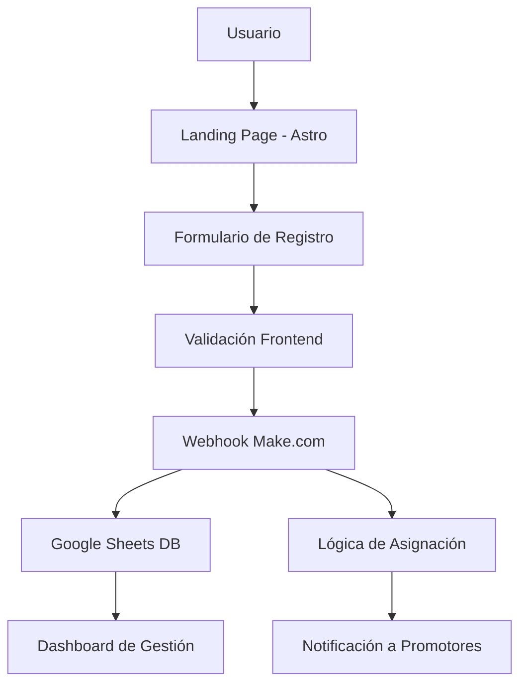

# 📋 DOCUMENTACIÓN COMPLETA - PROYECTO KENDA DISTRIBUIDORES

## 📑 **TABLA DE CONTENIDOS**

1. [Resumen Ejecutivo](#-resumen-ejecutivo)
2. [Arquitectura del Sistema](#-arquitectura-del-sistema)
3. [Flujo de Datos Completo](#-flujo-de-datos-completo)
4. [Frontend - Aplicación Web](#-frontend---aplicación-web)
5. [Backend - Make + Google Sheets](#-backend---make--google-sheets)
6. [Base de Datos - Google Sheets](#-base-de-datos---google-sheets)
7. [Sistema de Asignación de Promotores](#-sistema-de-asignación-de-promotores)
8. [APIs y Webhooks](#-apis-y-webhooks)
9. [Instalación y Configuración](#-instalación-y-configuración)
10. [Casos de Uso](#-casos-de-uso)
11. [Mantenimiento y Escalabilidad](#-mantenimiento-y-escalabilidad)

---

## 🎯 **RESUMEN EJECUTIVO**

### **Objetivo del Proyecto**
Sistema de captación y gestión de leads para el programa de distribuidores KENDA México, con asignación automática de promotores basada en ubicación geográfica.

### **Propuesta de Valor**
- **Para KENDA**: Automatización completa del proceso de captación de distribuidores
- **Para Distribuidores**: Experiencia de usuario optimizada con respuesta inmediata
- **Para Promotores**: Asignación inteligente de leads por región geográfica

### **Métricas Clave**
- **36+ leads** registrados actualmente
- **5,000+ distribuidores** activos en México
- **$50,000 MXN** inversión inicial mínima
- **66 años** de experiencia en el mercado

---

## 🏗️ **ARQUITECTURA DEL SISTEMA**



### **Stack Tecnológico**

#### **Frontend**
- **Framework**: Astro 5.7.9
- **UI**: React 19.1.0 + TypeScript
- **Styling**: Tailwind CSS v4.1.5
- **Animaciones**: GSAP 3.13.0
- **Hosting**: Netlify/Vercel (recomendado)

#### **Backend**
- **Automation**: Make.com (Integromat)
- **Database**: Google Sheets API
- **Notifications**: WhatsApp/Email integration
- **Analytics**: Google Analytics 4

#### **Integración**
- **Webhook**: Make.com endpoint
- **Data Storage**: Google Sheets
- **Communication**: WhatsApp API

---

## 🔄 **FLUJO DE DATOS COMPLETO**

### **1. Captación de Lead**
```typescript
// FormSection.astro - Captura inicial
const formData = {
  nombre: string,
  email: string,
  telefono: string,
  giroComercial: 'agencia' | 'taller' | 'refaccionaria' | 'otro' | 'no',
  estado: string, // Estado de México
  inversion: string,
  inicioOperaciones: string
}
```

### **2. Procesamiento Backend**
```javascript
// Make.com - Lógica de procesamiento
1. Recibir webhook POST
2. Validar datos de entrada
3. Determinar promotor(es) por estado
4. Guardar en Google Sheets
5. Enviar notificaciones
6. Responder al frontend
```

### **3. Almacenamiento**
```
Google Sheets Columns:
- NOMBRE
- EMAIL  
- TELEFONO
- GIRO COMERCIAL
- ESTADO
- INVERSIÓN
- INICIO DE OPERACIONES
- ASESOR QUE ATENDERA
```

### **4. Notificación**
- **WhatsApp** al promotor asignado
- **Email** de confirmación al lead
- **Registro** en analytics

---

## 💻 **FRONTEND - APLICACIÓN WEB**

### **Arquitectura de Componentes**

```
src/
├── components/
│   ├── form/
│   │   └── FormSection.astro          # Componente principal
│   ├── sections/
│   │   ├── HeroSection.astro          # Landing principal
│   │   ├── BenefitsSection.astro      # Beneficios
│   │   └── TestimonialsSection.astro  # Social proof
│   └── ui/
│       ├── custom/                    # Componentes custom
│       └── shadcn/                    # Design system
├── data/
│   └── benefits.ts                    # Datos tipados
└── layouts/
    └── BaseLayout.astro              # Layout base
```

### **Características Técnicas**

#### **FormSection.astro - Componente Principal**
```typescript
// Sistema de asignación de promotores
const PROMOTORES_POR_ESTADO = {
  'mexico': {
    tipo: 'multiple',
    asesores: [
      {
        nombre: 'ALEJANDRO ROBERTO PIÑA GARCIA',
        whatsapp: '5527378228',
        email: 'ventas.sur@motosyequipos.com',
        prioridad: 'principal'
      },
      {
        nombre: 'OCTAVIO NAVARRETE FERNANDEZ', 
        whatsapp: '5527378228',
        email: 'ventas.centro@motosyequipos.com',
        prioridad: 'alternativo'
      }
    ]
  },
  // ... otros estados
}
```

#### **Validación Frontend**
- **Tiempo real**: Validación mientras el usuario escribe
- **Patrones**: Regex para teléfonos mexicanos
- **Accesibilidad**: ARIA labels y mensajes de error
- **Auto-save**: localStorage para recuperación

#### **UX/UI Features**
- **Responsive**: Mobile-first design
- **Animaciones**: Micro-interactions con CSS/GSAP
- **Performance**: Lazy loading e images optimizadas
- **SEO**: Meta tags completos y structured data

---

## 🔧 **BACKEND - MAKE + GOOGLE SHEETS**

### **Make.com Workflow**

#### **Trigger: Webhook**
```json
POST /webhook/kenda-leads
Content-Type: application/json

{
  "nombre": "Juan Pérez García",
  "email": "juan@ejemplo.com", 
  "telefono": "5512345678",
  "giroComercial": "taller",
  "estado": "mexico",
  "inversion": "50k-100k",
  "inicioOperaciones": "3-6 meses",
  "promotorAsignado": {
    "principal": "ALEJANDRO ROBERTO PIÑA GARCIA",
    "alternativo": "OCTAVIO NAVARRETE FERNANDEZ"
  }
}
```

#### **Processing Steps**
1. **Data Validation**
   - Verificar campos requeridos
   - Validar formato de email/teléfono
   - Sanitizar entrada de datos

2. **Promoter Assignment**
   - Consultar tabla de asignación por estado
   - Determinar promotor(es) disponibles
   - Aplicar lógica de load balancing

3. **Data Storage**
   - Insertar nueva fila en Google Sheets
   - Timestamp de creación
   - Generar ID único de lead

4. **Notifications**
   - WhatsApp al promotor asignado
   - Email de bienvenida al lead
   - Notificación interna al admin

#### **Error Handling**
```javascript
// Make.com Error Handler
if (webhook.failed) {
  // Reintentar hasta 3 veces
  // Notificar a admin si falla definitivamente
  // Guardar en log de errores
}
```

---

## 📊 **BASE DE DATOS - GOOGLE SHEETS**

### **Estructura de la Hoja Principal**

**URL**: `https://docs.google.com/spreadsheets/d/1DJIjuRAs_fLtoweKXX4xbrt8bLIqHAnB3AcFCMeFal8/edit`

| Columna | Tipo | Descripción | Ejemplo |
|---------|------|-------------|---------|
| NOMBRE | Text | Nombre completo | "Juan Pérez García" |
| EMAIL | Email | Correo electrónico | "juan@ejemplo.com" |
| TELEFONO | Text | Teléfono con código país | "5512345678" |
| GIRO COMERCIAL | Enum | Tipo de negocio | "taller", "agencia", "refaccionaria" |
| ESTADO | Text | Estado de México | "mexico", "jalisco", "nuevo-leon" |
| INVERSIÓN | Text | Rango de inversión | "50k-100k", "100k-500k" |
| INICIO DE OPERACIONES | Text | Tiempo estimado | "3-6 meses", "6-12 meses" |
| ASESOR QUE ATENDERA | Text | Promotor asignado | "ALEJANDRO ROBERTO PIÑA GARCIA" |

### **Hojas Adicionales**

#### **Hoja "Promotores"**
| Columna | Descripción |
|---------|-------------|
| Nombre | Nombre del promotor |
| Estados | Estados asignados |
| WhatsApp | Número de contacto |
| Email | Correo de trabajo |
| Región | Norte, Centro, Sur |

#### **Hoja "Analytics"**
| Columna | Descripción |
|---------|-------------|
| Fecha | Timestamp del lead |
| Estado | Estado de origen |
| Conversión | Si se convirtió a distribuidor |
| Promotor | Quien atendió |

### **Permisos y Seguridad**
- **Lectura**: Make.com service account
- **Escritura**: Make.com + Admin users
- **Backup**: Exportación automática semanal
- **Acceso**: Restringido por dominio corporativo

---

## 🎯 **SISTEMA DE ASIGNACIÓN DE PROMOTORES**

### **Lógica de Asignación**

#### **Por Estado Geográfico**
```typescript
// Estados con promotor único
const ASIGNACION_SIMPLE = {
  'jalisco': 'ALEJANDRO ROBERTO PIÑA GARCIA',
  'nuevo-leon': 'LUIS MARTINEZ RODRIGUEZ',
  'veracruz': 'CARLOS GOMEZ HERNANDEZ'
}

// Estados con múltiples promotores
const ASIGNACION_MULTIPLE = {
  'mexico': {
    tipo: 'dual',
    principal: 'ALEJANDRO ROBERTO PIÑA GARCIA',
    alternativo: 'OCTAVIO NAVARRETE FERNANDEZ',
    criterio: 'round_robin' // o 'load_balancing'
  }
}
```

#### **Algoritmos de Distribución**

1. **Round Robin**: Alternar entre promotores
2. **Load Balancing**: Basado en carga actual
3. **Geographic Proximity**: Por cercanía geográfica
4. **Expertise Match**: Por especialización

### **Escalation Rules**
```javascript
// Si promotor principal no responde en 2 horas
if (noResponse && timeElapsed > 2hours) {
  assignToAlternative(lead);
  notifyManager(escalation);
}
```

---

## 🔌 **APIS Y WEBHOOKS**

### **Webhook Endpoint**

#### **URL**: `https://hook.make.com/[WEBHOOK_ID]`

#### **Método**: `POST`

#### **Headers**
```http
Content-Type: application/json
Authorization: Bearer [MAKE_TOKEN]
User-Agent: KENDA-Frontend/1.0
```

#### **Request Body**
```json
{
  "timestamp": "2024-01-15T10:30:00Z",
  "source": "web-form",
  "data": {
    "nombre": "Juan Pérez García",
    "email": "juan@ejemplo.com",
    "telefono": "5512345678",
    "giroComercial": "taller",
    "estado": "mexico",
    "inversion": "50k-100k",
    "inicioOperaciones": "3-6 meses"
  },
  "metadata": {
    "userAgent": "Mozilla/5.0...",
    "ipAddress": "192.168.1.1",
    "referrer": "https://google.com"
  }
}
```

#### **Response**
```json
{
  "success": true,
  "leadId": "LEAD_2024_001234",
  "promotorAsignado": {
    "nombre": "ALEJANDRO ROBERTO PIÑA GARCIA",
    "whatsapp": "5527378228",
    "tiempoRespuesta": "2-4 horas"
  },
  "message": "Lead registrado exitosamente"
}
```

### **Error Responses**
```json
{
  "success": false,
  "error": {
    "code": "VALIDATION_ERROR",
    "message": "Email format invalid",
    "field": "email"
  }
}
```

### **Rate Limiting**
- **Límite**: 100 requests/hora por IP
- **Burst**: 10 requests/minuto
- **Cooldown**: 24 horas para IPs bloqueadas

---

## 🚀 **INSTALACIÓN Y CONFIGURACIÓN**

### **Prerequisitos**
- Node.js 18+
- npm o yarn
- Cuenta Google Cloud (para Sheets API)
- Cuenta Make.com
- Dominio para hosting

### **1. Frontend Setup**

```bash
# Clonar repositorio
git clone [REPO_URL]
cd kenda

# Instalar dependencias
npm install

# Variables de entorno
cp .env.example .env.local
```

#### **Environment Variables**
```env
# .env.local
PUBLIC_MAKE_WEBHOOK_URL=https://hook.make.com/[WEBHOOK_ID]
PUBLIC_GA_ID=G-9MY6DBBCDC
PUBLIC_SITE_URL=https://distribuidorkenda.com
GOOGLE_SHEETS_ID=1DJIjuRAs_fLtoweKXX4xbrt8bLIqHAnB3AcFCMeFal8
```

### **2. Make.com Setup**

#### **Crear Scenario**
1. **Trigger**: Custom Webhook
2. **Module 1**: Data validation
3. **Module 2**: Google Sheets insert
4. **Module 3**: WhatsApp notification
5. **Module 4**: Email confirmation

#### **Webhook Configuration**
```json
{
  "url": "https://hook.make.com/[GENERATED_ID]",
  "method": "POST",
  "headers": {
    "Content-Type": "application/json"
  }
}
```

### **3. Google Sheets Setup**

#### **Crear Spreadsheet**
```bash
# Template spreadsheet
https://docs.google.com/spreadsheets/d/1DJIjuRAs_fLtoweKXX4xbrt8bLIqHAnB3AcFCMeFal8/copy
```

#### **Configurar API Access**
1. Google Cloud Console
2. Enable Sheets API
3. Create Service Account
4. Download credentials.json
5. Share spreadsheet with service email

### **4. Deployment**

#### **Frontend Deployment**
```bash
# Build for production
npm run build

# Deploy to Netlify
netlify deploy --prod --dir dist

# O deploy to Vercel
vercel --prod
```

#### **DNS Configuration**
```dns
# DNS Records
A     @           [IP_ADDRESS]
CNAME www         [DOMAIN].netlify.app
CNAME api         hook.make.com
```

---

## 📋 **CASOS DE USO**

### **UC01: Registro de Nuevo Distribuidor**

#### **Actor**: Distribuidor potencial
#### **Precondiciones**: Acceso a internet, interés en distribución KENDA
#### **Flujo Principal**:
1. Usuario accede a landing page
2. Navega a formulario de registro
3. Completa campos obligatorios
4. Envía formulario
5. Recibe confirmación inmediata
6. Promotor contacta en 2-4 horas

#### **Flujo Alternativo**:
- **Error de validación**: Mostrar mensajes de error específicos
- **Promotor ocupado**: Asignar promotor alternativo
- **Estado sin cobertura**: Redirigir a contacto general

### **UC02: Gestión de Leads por Promotor**

#### **Actor**: Promotor de ventas
#### **Precondiciones**: Acceso a Google Sheets, WhatsApp configurado
#### **Flujo Principal**:
1. Recibe notificación de nuevo lead
2. Accede a información en Sheets
3. Contacta al prospecto
4. Actualiza status del lead
5. Programa seguimiento

### **UC03: Análisis de Performance**

#### **Actor**: Gerente de ventas
#### **Precondiciones**: Acceso a dashboard analytics
#### **Flujo Principal**:
1. Accede a métricas de conversión
2. Revisa performance por promotor
3. Analiza leads por estado
4. Genera reportes mensuales
5. Optimiza asignaciones

---

## 🔧 **MANTENIMIENTO Y ESCALABILIDAD**

### **Monitoreo**

#### **Métricas Clave**
- **Lead Volume**: Leads/día por estado
- **Response Time**: Tiempo respuesta promotores
- **Conversion Rate**: Leads → Distribuidores
- **System Health**: Uptime del webhook

#### **Alertas**
```javascript
// Make.com Monitoring
if (webhookFails > 3) {
  sendSlackAlert('Webhook failing - check immediately');
}

if (responseTime > 5seconds) {
  sendEmailAlert('Performance degradation detected');
}
```

### **Backup Strategy**

#### **Datos**
- **Google Sheets**: Backup diario automático
- **Make.com**: Export de scenarios mensual
- **Frontend**: Git repository + CI/CD

#### **Recovery Plan**
1. **RTO**: 2 horas máximo
2. **RPO**: 1 hora máximo de datos
3. **Rollback**: Deployment anterior en 15 minutos

### **Scaling Considerations**

#### **Horizontal Scaling**
```typescript
// Múltiples webhooks por región
const WEBHOOK_ENDPOINTS = {
  norte: 'https://hook.make.com/webhook-norte',
  centro: 'https://hook.make.com/webhook-centro', 
  sur: 'https://hook.make.com/webhook-sur'
}
```

#### **Performance Optimization**
- **CDN**: CloudFlare para assets estáticos
- **Caching**: Redis para datos de promotores
- **Load Balancing**: Múltiples instancias Make.com

### **Roadmap Técnico**

#### **Q1 2024**
- [ ] Dashboard analytics avanzado
- [ ] A/B testing framework
- [ ] Mobile app para promotores

#### **Q2 2024**
- [ ] AI-powered lead scoring
- [ ] Multi-language support
- [ ] CRM integration (HubSpot/Salesforce)

#### **Q3 2024**
- [ ] WhatsApp chatbot automation
- [ ] Video call scheduling
- [ ] Contract generation automation

---

## 📞 **SOPORTE Y CONTACTO**

### **Equipo Técnico**
- **Lead Developer**: [NOMBRE]
- **DevOps**: [NOMBRE]
- **QA**: [NOMBRE]

### **Contacto Emergencias**
- **Slack**: #kenda-alerts
- **Email**: tech-support@motosyequipos.com
- **Phone**: +52 81 8218 2838 Ext. 8332

### **Documentación Adicional**
- **API Docs**: `/docs/api`
- **Component Library**: `/docs/components`
- **Deployment Guide**: `/docs/deployment`

---

*Documentación generada el: 2025-06-26*
*Versión: 2.0.0*
*Última actualización: Erik Fabian Tamayo Heredia*