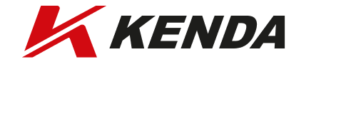
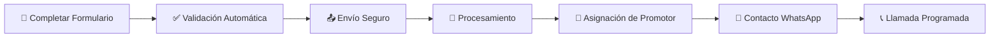

# 👥 MANUAL DE USUARIO - SISTEMA KENDA DISTRIBUIDORES

<div align="center">



**Guía completa para usuarios del sistema de captación de distribuidores KENDA México**

📱 **Versión Web** • 💻 **Multi-dispositivo** • ♿ **Accesible**

</div>

---

## 📑 **TABLA DE CONTENIDOS**

1. [Introducción](#-introducción)
2. [Acceso al Sistema](#-acceso-al-sistema)
3. [Navegación de la Página](#-navegación-de-la-página)
4. [Proceso de Registro](#-proceso-de-registro)
5. [Formulario Paso a Paso](#-formulario-paso-a-paso)
6. [Confirmación y Seguimiento](#-confirmación-y-seguimiento)
7. [Preguntas Frecuentes](#-preguntas-frecuentes)
8. [Solución de Problemas](#-solución-de-problemas)
9. [Contacto y Soporte](#-contacto-y-soporte)

---

## 🎯 **INTRODUCCIÓN**

### **¿Qué es el Sistema KENDA Distribuidores?**

El sistema KENDA Distribuidores es una plataforma web diseñada para facilitar el proceso de registro de nuevos distribuidores de neumáticos KENDA en México. A través de esta herramienta, los interesados pueden:

- ✅ **Conocer los beneficios** del programa de distribuidores
- ✅ **Registrar su interés** de manera rápida y segura
- ✅ **Recibir atención personalizada** de promotores especializados
- ✅ **Obtener información** sobre inversión y requisitos

### **¿Quién puede usar este sistema?**

- **Emprendedores** interesados en el sector automotriz
- **Propietarios de talleres** mecánicos
- **Dueños de refaccionarias** o agencias de motos
- **Inversionistas** con capital disponible ($50,000+ MXN)
- **Personas** que buscan oportunidades de negocio

---

## 🌐 **ACCESO AL SISTEMA**

### **Requisitos del Dispositivo**

#### **Computadora**
- **Navegador**: Chrome, Firefox, Safari o Edge (última versión)
- **Conexión**: Internet estable
- **Resolución**: Mínimo 1024x768 píxeles

#### **Dispositivo Móvil**
- **Sistema**: iOS 12+ o Android 8+
- **Navegador**: Safari, Chrome o navegador predeterminado
- **Conexión**: WiFi o datos móviles

### **Cómo Acceder**

1. **Abrir navegador web**
2. **Escribir la dirección**: `https://distribuidorkenda.com`
3. **Presionar Enter** o tocar "Ir"
4. **Esperar** a que cargue la página (2-3 segundos)

> 💡 **Tip**: Guarda la página en favoritos para acceso rápido

---

## 🧭 **NAVEGACIÓN DE LA PÁGINA**

### **Estructura de la Página Principal**

```
┌─────────────────────────────────────┐
│           🏠 INICIO                 │
├─────────────────────────────────────┤
│           💎 BENEFICIOS             │
├─────────────────────────────────────┤
│           📋 REQUISITOS             │
├─────────────────────────────────────┤
│           👥 TESTIMONIOS            │
├─────────────────────────────────────┤
│           📝 FORMULARIO             │
├─────────────────────────────────────┤
│           🏢 MARCAS                 │
└─────────────────────────────────────┘
```

### **Navegación por Secciones**

#### **🏠 Sección de Inicio**
- **Título principal**: "¿Te interesa ser Distribuidor KENDA?"
- **Botón de acción**: "Iniciar registro" (naranja)
- **Información clave**: 66 años de experiencia, 5,000+ distribuidores

#### **💎 Sección de Beneficios**
Muestra 5 tarjetas con los principales beneficios:
1. **Descuentos Exclusivos**
2. **Capacitación Continua**
3. **Asesoría y Soporte**
4. **Apoyo Publicitario**
5. **Financiamiento**

#### **📋 Sección de Requisitos**
Información transparente sobre:
- **Inversión inicial**: Desde $50,000 MXN
- **Tipo de negocio**: Preferible sector automotriz
- **Compromiso**: Dedicación al crecimiento

#### **👥 Sección de Testimonios**
Testimonios reales de distribuidores actuales con:
- **Nombres** y ubicaciones
- **Experiencias** positivas
- **Resultados** obtenidos

#### **📝 Sección de Formulario**
El formulario principal de registro (explicado en detalle más adelante)

#### **🏢 Sección de Marcas**
Logos de marcas asociadas y certificaciones

---

## 📝 **PROCESO DE REGISTRO**

### **Visión General del Proceso**



### **Tiempo Estimado**

- **Completar formulario**: 3-5 minutos
- **Validación y envío**: 30 segundos
- **Contacto inicial**: 2-4 horas
- **Primera llamada**: 24-48 horas

### **Información Requerida**

Antes de comenzar, ten a la mano:
- ✅ **Nombre completo**
- ✅ **Correo electrónico** (activo y que revises frecuentemente)
- ✅ **Teléfono celular** (con WhatsApp preferible)
- ✅ **Estado** donde te ubicas
- ✅ **Información de tu negocio** (si tienes uno)
- ✅ **Monto de inversión** disponible
- ✅ **Tiempo estimado** para iniciar operaciones

---

## 📋 **FORMULARIO PASO A PASO**

### **Acceso al Formulario**

#### **Opción 1: Botón Principal**
1. En la sección de inicio, busca el botón naranja **"Iniciar registro"**
2. Haz clic o toca el botón
3. La página se desplazará automáticamente al formulario

#### **Opción 2: Navegación Manual**
1. Desplázate hacia abajo hasta encontrar la sección **"Formulario"**
2. También puedes usar el scroll o las teclas de flecha

### **Completar el Formulario**

#### **📝 Paso 1: Información Personal**

**Campo: Nombre Completo**
- **Qué escribir**: Tu nombre y apellidos completos
- **Ejemplo**: "Juan Pérez García"
- **Validación**: Se valida que no esté vacío
- **Tip**: Usa tu nombre legal como aparece en identificaciones

**Campo: Correo Electrónico**
- **Qué escribir**: Tu email principal y activo
- **Ejemplo**: "juan.perez@gmail.com"
- **Validación**: Formato de email válido
- **Tip**: Usa un correo que revises frecuentemente

**Campo: Teléfono**
- **Qué escribir**: Tu número de celular con 10 dígitos
- **Ejemplo**: "5512345678"
- **Validación**: Formato de teléfono mexicano
- **Tip**: Preferible un número con WhatsApp

#### **📝 Paso 2: Información de Negocio**

**Campo: ¿Tienes un negocio enfocado al sector de motocicletas o autos?**

Opciones disponibles:
- 🏪 **"Agencia de motos"** - Si vendes motocicletas
- 🔧 **"Taller mecánico"** - Si ofreces servicios de reparación
- 🛠️ **"Refaccionaria"** - Si vendes repuestos y accesorios
- 📦 **"Otro"** - Si tienes otro tipo de negocio relacionado
- ❌ **"No"** - Si no tienes negocio actualmente

> 💡 **Nota**: Tener un negocio relacionado es preferible pero no eliminatorio

**Campo: Estado**
- **Qué seleccionar**: El estado de México donde te ubicas
- **Opciones**: Los 32 estados mexicanos están disponibles
- **Importante**: Esto determina qué promotor te contactará

#### **📝 Paso 3: Información de Inversión**

**Campo: ¿Cuál es tu capital de inversión?**

Rangos disponibles:
- 💰 **"$50,000 - $100,000 MXN"** - Inversión inicial básica
- 💰 **"$100,000 - $250,000 MXN"** - Inversión intermedia
- 💰 **"$250,000 - $500,000 MXN"** - Inversión considerable
- 💰 **"Más de $500,000 MXN"** - Inversión alta

> 💡 **Tip**: Sé realista con tu capacidad de inversión

**Campo: ¿Cuándo te gustaría iniciar operaciones?**

Opciones de tiempo:
- ⏰ **"3 meses"** - Inicio rápido
- ⏰ **"6 meses"** - Planeación intermedia
- ⏰ **"12 meses"** - Planeación a largo plazo

### **🔄 Funciones Automáticas del Formulario**

#### **Auto-guardado**
- El formulario guarda automáticamente tu progreso
- Si cierras accidentalmente la página, tu información se mantiene
- Los datos se guardan cada vez que completas un campo

#### **Validación en Tiempo Real**
- **Campos obligatorios**: Se marcan con asterisco (*) rojo
- **Errores**: Se muestran mensajes específicos bajo cada campo
- **Éxito**: Aparece una marca verde cuando el campo es válido

#### **Información del Promotor**
- Al seleccionar tu estado, aparece información sobre tu promotor asignado
- Puedes ver el nombre y tiempo estimado de respuesta

### **📤 Envío del Formulario**

#### **Antes de Enviar**
1. **Revisa todos los campos** que estén completos y correctos
2. **Verifica tu email** especialmente
3. **Confirma tu teléfono** para WhatsApp
4. **Asegúrate** de haber seleccionado tu estado correcto

#### **Proceso de Envío**
1. **Hacer clic** en el botón "Enviar formulario"
2. **Esperar** el mensaje de confirmación (loading spinner)
3. **Ver notificación** de éxito en la parte inferior
4. **Leer** la información sobre próximos pasos

#### **Qué Sucede Tras el Envío**
- ✅ Tus datos se almacenan de forma segura
- ✅ Se asigna automáticamente un promotor según tu estado
- ✅ El promotor recibe una notificación inmediata por WhatsApp
- ✅ Recibes un email de confirmación
- ✅ El promotor te contactará en 2-4 horas

---

## ✅ **CONFIRMACIÓN Y SEGUIMIENTO**

### **Confirmación Inmediata**

Después de enviar el formulario, verás:

```
┌─────────────────────────────────────┐
│  ✅ ¡Formulario enviado con éxito!  │
│                                     │
│  📱 Tu promotor asignado es:        │
│     [Nombre del Promotor]           │
│                                     │
│  📞 Te contactará en: 2-4 horas     │
│                                     │
│  📧 Revisa tu email para más info   │
└─────────────────────────────────────┘
```

### **Email de Confirmación**

Recibirás un email con:
- ✅ **Confirmación** de registro exitoso
- 👤 **Información del promotor** asignado
- 📞 **Número de contacto** directo
- 📋 **Resumen** de la información enviada
- 🕐 **Próximos pasos** del proceso

### **Contacto del Promotor**

#### **WhatsApp (2-4 horas)**
- **Mensaje inicial** con presentación
- **Confirmación** de datos básicos
- **Programación** de llamada detallada

#### **Llamada Telefónica (24-48 horas)**
- **Presentación** formal del programa
- **Aclaración** de dudas específicas
- **Evaluación** de perfil y viabilidad
- **Próximos pasos** del proceso

### **Qué Esperar en la Primera Llamada**

#### **Duración**: 20-30 minutos

#### **Agenda Típica**:
1. **Presentación** del promotor y KENDA
2. **Revisión** de tu perfil e interés
3. **Explicación detallada** del programa
4. **Requisitos específicos** para tu caso
5. **Inversión requerida** y términos
6. **Proceso de aprobación** siguiente
7. **Cronograma** de implementación
8. **Preguntas** y respuestas

#### **Documentos a Preparar**:
- 📄 Identificación oficial
- 🏢 Comprobante de domicilio
- 💰 Comprobante de ingresos o capacidad financiera
- 🏪 Documentos del negocio (si aplica)

---

## ❓ **PREGUNTAS FRECUENTES**

### **Sobre el Registro**

**P: ¿Es gratuito registrarse?**
R: Sí, el proceso de registro y evaluación es completamente gratuito.

**P: ¿Cuánto tiempo toma el proceso completo?**
R: Desde el registro hasta la aprobación final: 2-4 semanas típicamente.

**P: ¿Puedo registrarme si no tengo negocio actualmente?**
R: Sí, puedes registrarte. Evaluaremos tu perfil y te orientaremos sobre las opciones.

**P: ¿Qué pasa si no me contactan en el tiempo indicado?**
R: Contáctanos directamente al teléfono de soporte: +52 81 8218 2838 Ext. 8332

### **Sobre la Inversión**

**P: ¿La inversión mínima es fija?**
R: El mínimo es $50,000 MXN, pero la inversión óptima depende de tu mercado y objetivos.

**P: ¿Hay financiamiento disponible?**
R: Sí, ofrecemos líneas de crédito y descuentos por pago de contado.

**P: ¿Qué incluye la inversión inicial?**
R: Inventario inicial, material promocional, capacitación y soporte de lanzamiento.

### **Sobre el Territorio**

**P: ¿Puedo elegir mi territorio de distribución?**
R: Los territorios se asignan según disponibilidad y tu ubicación/capacidad.

**P: ¿Hay exclusividad territorial?**
R: Sí, cada distribuidor tiene un territorio exclusivo según el acuerdo.

**P: ¿Puedo expandir mi territorio después?**
R: Sí, según tu desempeño y disponibilidad de territorios adyacentes.

### **Sobre el Soporte**

**P: ¿Qué tipo de capacitación recibo?**
R: Capacitación técnica de productos, ventas, marketing y gestión del negocio.

**P: ¿Hay soporte continuo?**
R: Sí, tienes un promotor asignado para soporte técnico y comercial permanente.

**P: ¿Cómo funciona el apoyo publicitario?**
R: Proporcionamos material promocional, campañas digitales y apoyo en eventos.

---

## 🔧 **SOLUCIÓN DE PROBLEMAS**

### **Problemas con la Página Web**

#### **La página no carga**
**Síntomas**: Página en blanco o error de conexión
**Soluciones**:
1. Verificar conexión a internet
2. Refrescar la página (F5 o Ctrl+R)
3. Limpiar caché del navegador
4. Intentar con otro navegador
5. Verificar que la URL sea correcta: `distribuidorkenda.com`

#### **El formulario no se envía**
**Síntomas**: Botón no responde o mensajes de error
**Soluciones**:
1. Verificar que todos los campos obligatorios estén completos
2. Revisar formato del email (debe contener @ y dominio)
3. Revisar formato del teléfono (10 dígitos)
4. Esperar unos segundos si hay lentitud
5. Refrescar página y intentar nuevamente

#### **Los campos no se llenan**
**Síntomas**: No puedes escribir en los campos
**Soluciones**:
1. Hacer clic directamente en el campo
2. Verificar que JavaScript esté habilitado
3. Desactivar bloqueadores de anuncios temporalmente
4. Intentar con modo incógnito/privado

### **Problemas con Dispositivos Móviles**

#### **Texto muy pequeño**
**Solución**: Pellizcar la pantalla para hacer zoom o cambiar orientación a horizontal

#### **Botones no responden**
**Solución**: Asegurarse de tocar directamente el botón, no cerca de él

#### **Teclado cubre campos**
**Solución**: Desplazar la página hacia arriba o rotar el dispositivo

### **Problemas de Contacto**

#### **No recibí email de confirmación**
**Revisar**:
1. Carpeta de spam/correo no deseado
2. Escribir correctamente el email en el formulario
3. Esperar hasta 15 minutos para la entrega
4. Contactar soporte si persiste el problema

#### **El promotor no me contactó**
**Acciones**:
1. Verificar que proporcionaste el teléfono correcto
2. Revisar mensajes de WhatsApp y llamadas perdidas
3. Esperar hasta 6 horas en días laborales
4. Contactar directamente a soporte

### **Códigos de Error Comunes**

| Código | Descripción | Solución |
|--------|-------------|----------|
| 400 | Datos de formulario inválidos | Revisar campos obligatorios |
| 404 | Página no encontrada | Verificar URL correcta |
| 500 | Error del servidor | Esperar unos minutos e intentar |
| 503 | Servicio no disponible | Intentar más tarde |

---

## 📞 **CONTACTO Y SOPORTE**

### **Información de Contacto Principal**

#### **📞 Teléfono de Soporte**
- **Número**: +52 (81) 8218 2838 Ext. 8332
- **Horario**: Lunes a Viernes, 9:00 AM - 6:00 PM (Hora de México)
- **Para**: Problemas técnicos, seguimiento de registro, dudas generales

#### **📧 Email de Soporte**
- **Dirección**: soporte@motosyequipos.com
- **Respuesta**: 24-48 horas en días hábiles
- **Para**: Consultas detalladas, documentación, problemas complejos

#### **💬 WhatsApp de Soporte**
- **Número**: +52 81 8218 2838
- **Horario**: Lunes a Viernes, 9:00 AM - 6:00 PM
- **Para**: Consultas rápidas, verificación de status

### **Información por Región**

#### **📍 Centro (CDMX, Estado de México, Hidalgo, Morelos, Puebla, Tlaxcala)**
- **Promotor**: Alejandro Roberto Piña García
- **WhatsApp**: +52 55 2737 8228
- **Email**: ventas.centro@motosyequipos.com

#### **📍 Norte (Nuevo León, Coahuila, Chihuahua, Tamaulipas, Sonora)**
- **Promotor**: Luis Martínez Rodríguez
- **WhatsApp**: +52 81 1234 5678
- **Email**: ventas.norte@motosyequipos.com

#### **📍 Sur (Veracruz, Oaxaca, Chiapas, Tabasco, Campeche, Yucatán, Quintana Roo)**
- **Promotor**: Carlos Gómez Hernández
- **WhatsApp**: +52 55 8765 4321
- **Email**: ventas.sur@motosyequipos.com

### **Horarios de Atención**

| Servicio | Horario | Días |
|----------|---------|------|
| **Soporte Técnico** | 9:00 AM - 6:00 PM | Lunes - Viernes |
| **Ventas/Promoción** | 8:00 AM - 7:00 PM | Lunes - Sábado |
| **Emergencias** | 24/7 | WhatsApp únicamente |

### **Antes de Contactar Soporte**

#### **Ten a la mano**:
- ✅ **Información personal** utilizada en el registro
- ✅ **Email de confirmación** (si lo recibiste)
- ✅ **Descripción detallada** del problema
- ✅ **Dispositivo y navegador** que usas
- ✅ **Captura de pantalla** del error (si aplica)

#### **Describe claramente**:
- 🔍 **Qué estabas haciendo** cuando ocurrió el problema
- 🔍 **Qué esperabas** que pasara
- 🔍 **Qué pasó** en realidad
- 🔍 **Pasos** que ya intentaste para solucionarlo

### **Política de Privacidad**

Tu información personal está protegida según la Ley Federal de Protección de Datos Personales. Solo se usa para:
- ✅ Procesamiento de tu solicitud
- ✅ Contacto por parte de promotores
- ✅ Seguimiento del proceso de distribución
- ✅ Comunicaciones relacionadas con KENDA

No compartimos tu información con terceros sin tu consentimiento explícito.

---

## 📊 **RECURSOS ADICIONALES**

### **Materiales de Apoyo**

- 📁 [**Catálogo de Productos KENDA**](./docs/catalogo-kenda.pdf)
- 📋 [**Requisitos Detallados**](./docs/requisitos-distribuidor.pdf)
- 💰 [**Calculadora de Inversión**](./docs/calculadora-inversion.xlsx)
- 📈 [**Plan de Negocio Modelo**](./docs/plan-negocio-modelo.pdf)

### **Videos Informativos**

- 🎥 **Presentación KENDA**: Conoce la empresa y productos
- 🎥 **Casos de Éxito**: Testimonios de distribuidores exitosos
- 🎥 **Proceso Paso a Paso**: Guía visual del registro

### **Próximos Eventos**

- 📅 **Expo Motos México 2024**: Marzo 15-17, CDMX
- 📅 **Seminario Distribuidores**: Abril 22, Virtual
- 📅 **Capacitación Regional**: Mayo 10-12, Guadalajara

---

## ✅ **LISTA DE VERIFICACIÓN RÁPIDA**

### **Antes de Empezar**
- [ ] Conexión a internet estable
- [ ] Navegador actualizado
- [ ] Email activo y accesible
- [ ] Teléfono celular con WhatsApp
- [ ] Información de negocio (si aplica)
- [ ] Datos de inversión disponible

### **Durante el Registro**
- [ ] Nombre completo correcto
- [ ] Email escrito sin errores
- [ ] Teléfono de 10 dígitos
- [ ] Estado seleccionado correctamente
- [ ] Tipo de negocio apropiado
- [ ] Monto de inversión realista
- [ ] Tiempo de inicio planeado

### **Después del Envío**
- [ ] Mensaje de confirmación recibido
- [ ] Email de confirmación revisado
- [ ] WhatsApp disponible para contacto
- [ ] Documentos preparados para llamada
- [ ] Preguntas anotadas para el promotor

---

*Manual de Usuario v2.0.0 - Actualizado: 26 de Junio 2025*
*Desarrollado por: Erik Fabian Tamayo Heredia*
*© 2024 KENDA México - Motos y Equipos*